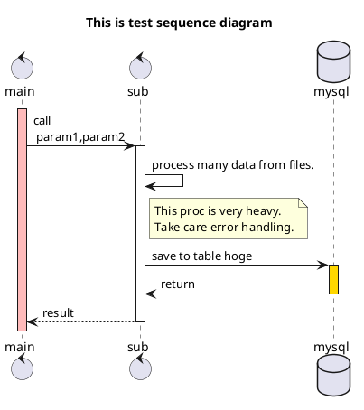

# documets
Private Markdown Documents

This is test document update from HackMD.

UML diagram is written in plantuml.

```plantuml
@startuml
title This is test sequence diagram
control main
control sub
database mysql

activate main #FFBBBB
main -> sub: call\n param1,param2
activate sub
sub -> sub: process many data from files.
note right sub
  This proc is very heavy.
  Take care error handling.
end note
sub -> mysql: save to table hoge
activate mysql #gold
mysql --> sub: return
deactivate mysql
sub --> main: result
deactivate sub
@enduml
```